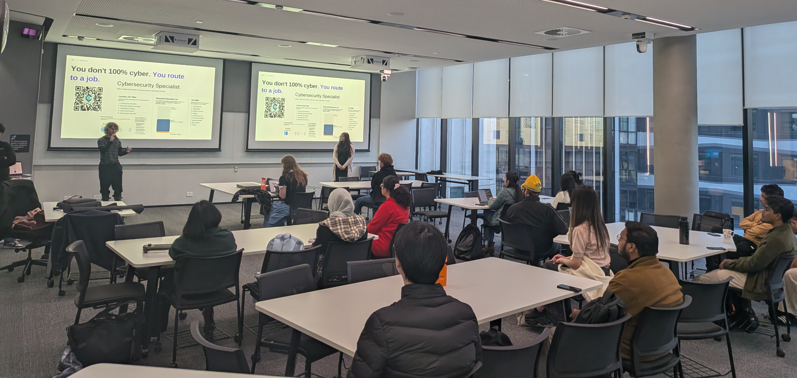

On **Friday, July 17th, 2026**, DUCA hosted a high-energy, high-impact workshop titled **"Speedrunning Cyber."** Held in room LC2.105 at the Deakin Burwood Campus, the event brought together a large crowd of eager students looking for real, direct advice on how to break into the cybersecurity industry before graduation. 

The session was led by two students who have successfully navigated this path:
- **Maple Fox**: Advisor and former DUCA President, who landed a full-time role as a Security Engineer before finishing her degree.
- **Sham Polavarapu**: Current DUCA President and second-year student already working as a Security Analyst at Sprightly and conducting research at Deakin.

They weren't speaking as decades-long industry veterans, but as peers just a few laps ahead on the track—meaning their route is fresh, relevant, and proven to work.

---

### You Don't "100%" Cyber: Route to a Job

One of the biggest traps for cyber students is the sheer size of the field. With security roadmaps listing hundreds of tools and over 480 certifications, it is easy to feel overwhelmed and try to learn everything.

The core message of the night was simple: **You don't 100% cyber. You route to a job.**

Just like speedrunners in video games skip entire zones to reach the end screen faster, successful students skip everything that doesn't save time. The goal is to focus heavily on the handful of core skills that get you hired, treating the rest of the vast security landscape as optional side quests.

### Choose Your Specialty: The Six Lanes

To make sense of the field, Maple and Sham mapped out the cybersecurity landscape into six main "lanes." They advised students to pick one to main, while maintaining a basic recognition of the others:

1. **Security Operations**: Watch, triage, and respond. The classic, beginner-friendly entry point into the industry.
2. **Penetration Testing**: Break in on purpose and write it up. Highly competitive, requiring a strong, non-negotiable portfolio.
3. **Application Security**: Secure the code and the pipeline. Excellent for those with a development or software engineering background.
4. **Cloud Security**: Secure the infrastructure where most real-world workloads now live. Extremely in-demand.
5. **Governance, Risk, and Compliance (GRC)**: Risk assessments, auditing, and policy. A low-code, highly structured route into the industry.
6. **Detection & Incident Response**: Hunt threats and clean up when things go wrong. Considered the "deep end" of defensive security.

The golden rule of the night? **Depth in one lane beats a shallow pass over all six.** Hiring managers are looking for a "spike" in a specific area of expertise, not a flat line of general knowledge.

### What to Study (and What to Skip)

Time is a speedrunner's most valuable asset. To make the most of it, the speakers shared a strict loadout of what to focus on and what to put on hold.

#### The Core Study Guide
1. **Networking Fundamentals**: Master TCP/IP, DNS, and HTTP. You cannot secure what you do not understand.
2. **Linux & The Command Line**: Spend time in the terminal until it stops being scary and starts feeling like second nature.
3. **One Scripting Language**: Learn Python. Knowing how to write basic scripts to automate repetitive tasks is a massive differentiator.
4. **How the Web Works**: Learn how requests, sessions, and authentication work, and study the OWASP Top 10 web vulnerabilities.
5. **One Specialty**: Take your chosen lane from the map and go deep, moving far beyond basic tutorials.

#### What to Skip (For Now)
*   **Collecting ten certs before your first job**: Credentials have rapidly diminishing returns.
*   **Memorizing every tool in Kali Linux**: Real security work is about understanding concepts, not memorizing tool syntax.
*   **$2,000 bootcamps promising instant jobs**: Most of these are overpriced and underdeliver.
*   **Malware reversing and assembly on day one**: Highly specialized and not on the critical path to a junior role.
*   **Waiting until you "feel ready"**: You will never feel 100% ready. Apply anyway.

*Note: Skipping doesn't mean never learning these topics. It simply means they are not on the critical path to your first role.*

### Degree, Certs, or Self-Study?

Students often debate the value of university degrees versus certifications or self-study. The workshop broke down how each serves a specific purpose in your speedrun:

*   **Degree (You're Already Here)**: The primary value of your degree is passing HR filters, opening doors to graduate programs, and offering a built-in network. Use it for internships and connecting with peers.
*   **Certifications (One, Maybe Two)**: A single entry-level cert (like CompTIA Security+ or a practical, hands-on cert) signals serious intent. Beyond that, certs should only be used to secure a specific keyword on your resume or enforce a study deadline.
*   **Self-Study (Where Skill Lives)**: Hands-on labs, CTFs, and public writeups are where real ability is built. Platforms like TryHackMe, Hack The Box, and PortSwigger are your main training grounds. Use them as proof that you can actually do the work.

### Build a Portfolio & Prove it in Public

When recruiters look at a junior resume, **proof beats potential**. You need to build things that a stranger can click on and evaluate.

A solid portfolio relies on three pillars:
1. **A Home Lab**: Set up virtual machines, configure a vulnerable box, and deploy a SIEM (Security Information and Event Management) system. Break it, fix it, and document it with screenshots.
2. **CTFs and Labs**: Maintain streaks and build up your rank on TryHackMe, Hack The Box, or picoCTF. These active profiles show continuous dedication.
3. **Writeups and Tools**: Document the boxes you break and the labs you build. Even a small Python automation script that you actually use counts as a portfolio project.

Once you have the proof, put it where people can see it. A strong GitHub repository (with real projects, not just forks), a basic blog for your writeups, an active CTF profile, and a complete LinkedIn profile will make you stand out. As the speakers noted: **if a recruiter finds your public proof, you're already half-sold.**

### Resume Optimization and the Job Hunt

The resume is your ticket to an interview, and a recruiter will only look at it for about six seconds. To optimize your callback rate, keep these guidelines in mind:

*   **DO**: Lead with clickable links (GitHub, blog, CTF profile) at the very top. Quantify your experience (e.g., *"triaged 40+ security alerts per week in my home lab"*). Mirror the job posting's keywords to get past automated applicant tracking systems (ATS), and keep the resume to a single page.
*   **DON'T**: List every tool you've ever opened once. Claim "expert" status as a student. Send the exact same generic resume to 200 jobs. Hide your best proof on page two.

When looking for openings, target roles that are realistic and open to students. These include Tier 1 SOC Analyst positions, IT Support roles (which allow you to pivot into security after a year), GRC Analyst roles, Junior Pentester roles (provided you have a stellar portfolio), Associate Cloud Security roles, and university-exclusive internships or graduate programs.

### The 12-Month Speedrunner's Route

To wrap up the talk, Maple and Sham shared an aggressive but highly doable 12-month timeline to run alongside your studies:

```
[Months 0-3: Foundations] --------> [Months 3-6: Pick a Lane] --------> [Months 6-9: Prove It] --------> [Months 9-12: Apply Wide]
- Networking, Linux, Python        - Go deep on one domain           - Get one entry cert          - Apply for internships/SOC roles
- Daily TryHackMe rooms            - Start a home lab & writeups     - Publish writeups & join CTFs- Iterate resume and interview
```

#### Avoiding Runs That Died
Many students' career search runs "die" due to common mistakes:
*   **Tutorial Hell**: Watching tutorials without building anything. Remember: watching is not doing.
*   **Cert Collecting**: Getting five certifications but having zero hands-on projects to show for it.
*   **Going Solo**: Trying to study entirely alone. No community means no referrals, no mentorship, and no momentum.
*   **Never Shipping**: Keeping projects private because they aren't "perfect." Publish the rough versions anyway!
*   **Only Chasing Senior Roles**: Applying to jobs that require 5+ years of experience instead of entry-level doors.

If your run has stalled, it's time to **respawn**. Focus on shipping just one small, public project this week.

### Community is the Ultimate Cheat Code

Most first jobs in cybersecurity come through a person, not an online job board. Both Maple and Sham landed their first professional roles because of connections they made in the local community. 

Get involved in local meetups, attend BSides conferences, join infosec Discords, participate in CTF teams, be active in your university's security club (like DUCA!), and seek out mentors. 

#### Start the Run Today:
*   **Tonight**: Create a TryHackMe account and complete just one room.
*   **This Week**: Start a basic blog and write up that room.
*   **This Month**: Show up to one local meetup or join a new security Discord and say hello.

A massive thank you to Maple and Sham for sharing their hard-earned insights. If you missed the event or want to review the material, you can download the slides via the QR code on our homepage or reach out to us on Discord.

GG, and see you at the next event!
